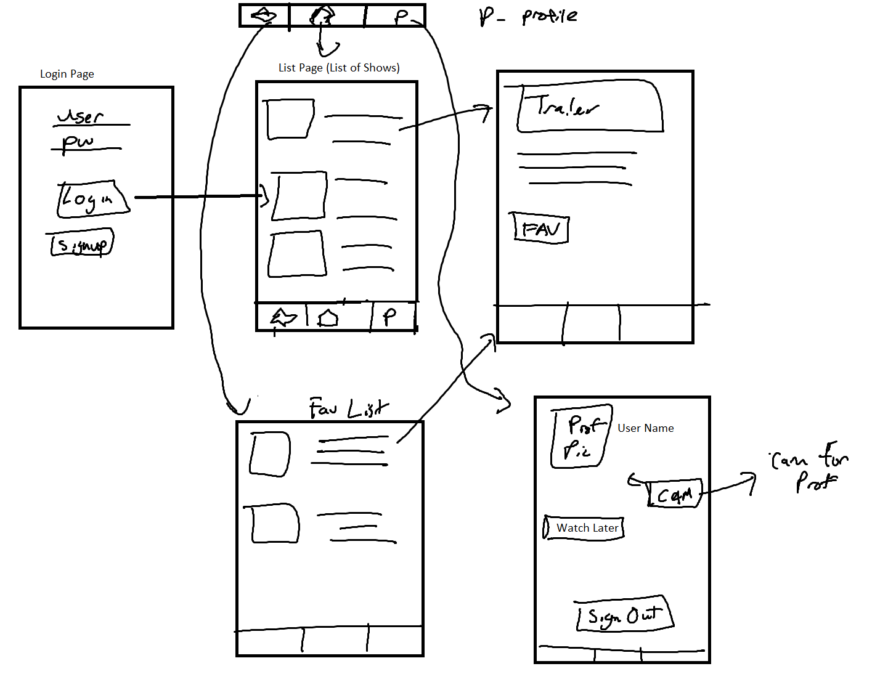

Original App Design Project - README Template
===

# SDW Shows

## Table of Contents
1. [Overview](#Overview)
1. [Product Spec](#Product-Spec)
1. [Wireframes](#Wireframes)
2. [Schema](#Schema)

## Overview
### Description
An app that allows users to look at the most popular tv shows at the moment and to see some data about those TV shows

### App Evaluation
[Evaluation of your app across the following attributes]
- **Category:**
    Entertainment
- **Mobile:**
    Taking picture for the user profile picture
- **Story:**
    Did you ever get tired of having to keep track of the episodes and tv    shows     you've watched on a text document or mentally keep track? This app is design to resolve those issues! 

- **Market:**
    Anyone who watches TV shows and wants to be up to date.
- **Habit:**
    Users will often sometimes to check up on their favorite TV shows
- **Scope:** 
    A few weeks to flesh out the basics and establish a foundation.
    
    
## Product Spec

### 1. User Stories (Required and Optional)

**Required Must-have Stories**

* [] The app needs to retrieves TV show data from the network and present this data within the app
* [] Detail page will contain TV show description, and trailer, with favorite button.
* [] Profile page that access camera to have a profile picture, signout button.
* [] Login page that allows users to log in or sign up

**Optional Nice-to-have Stories**

* [] Episode watch count on both list and detail page.
* [] Detail page containing list of episodes
* [] Notification of new episode.
* ...

### 2. Screen Archetypes

* Login 
* Register - User signs up or logs into their account
   * Upon Download/Reopening of the application, the user is prompted to log in to gain access to their profile information to be properly matched with another            person. 
* Home Screen
   * List of TV shows on a  main page.
   * Has a bottom bar connecting to profile, home and favorites page
* Profile Screen 
   * Allows user to upload a photo and fill in information that is interesting to them and others
   * ....
* Detail view
   * When a TV show is clicked on the main page, navigates to here
   * Shows a trailer of the TV show and list of episodes
   * ....
* Favorites List
   * Shows a list of TV shows that the user wants to keep track of
   * ....

### 3. Navigation

**Tab Navigation** (Tab to Screen)

* [Home (List of TV shows]
* [Favorite Tab (Shows your favorite shows, or those you mark to keep track of)]
* [Profile]

**Flow Navigation** (Screen to Screen)

* [Home (List of TV shows)]
   * []Favorite Window
   * []Profile Window
   * Shows Details
* [] Favorite Window
   * [] Shows
   * ...

## Wireframes
[Add picture of your hand sketched wireframes in this section]

### [BONUS] Digital Wireframes & Mockups

### [BONUS] Interactive Prototype

## Schema 
[This section will be completed in Unit 9]
### Models
[Add table of models]
### Networking
- [Add list of network requests by screen ]
- [Create basic snippets for each Parse network request]
- [OPTIONAL: List endpoints if using existing API such as Yelp]
